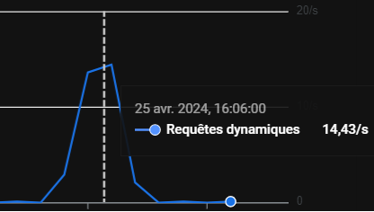
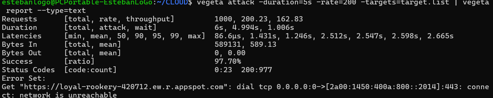
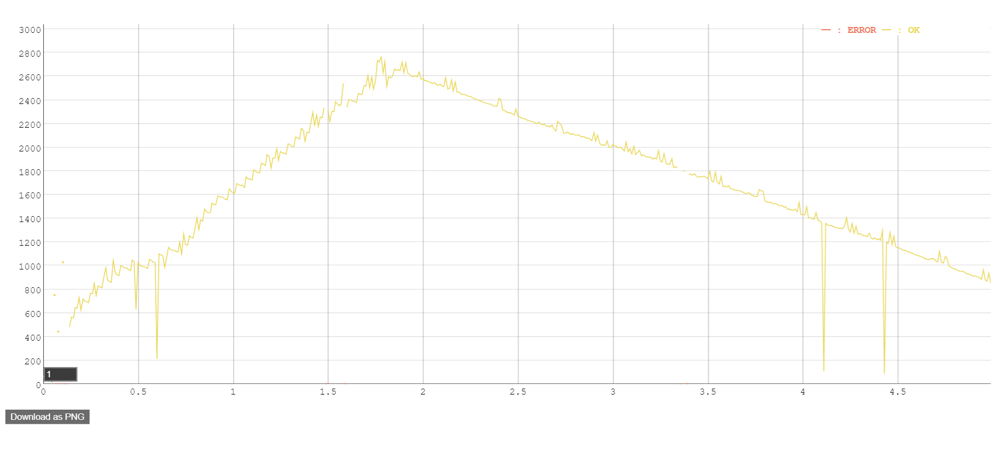
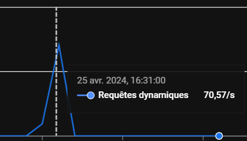
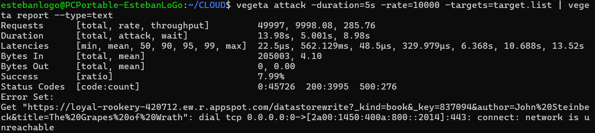
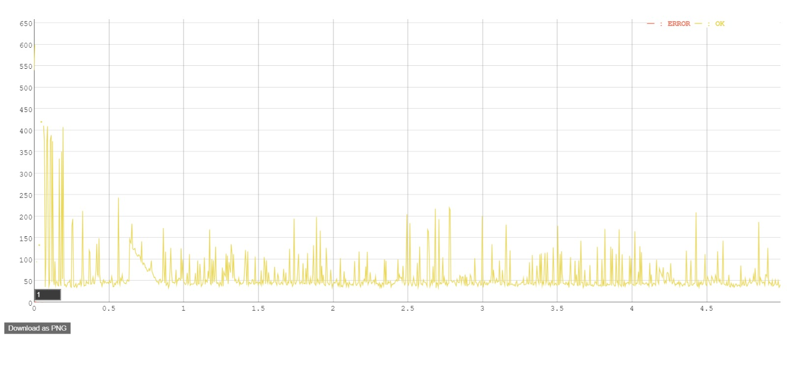

## Task 3: Test the performance of Datastore writes

In this task you will performance test the App Engine platform with a
load generator. You will compare the performance of normal request
processing and request processing that involves Datastore write
operations.

As the Servlets are deployed with Automatic Scaling, there is a danger
of consuming a lot of resources while testing, and burning through a
lot of money. Google gave you a coupon with some money that was put
into a billing account. Projects can have spending limits, but by
default it is unlimited. Before starting the performance test, you
have to set a reasonable daily spending limit.

Set a daily spending limit on the project as follows:

- In the Cloud Platform console navigate to **App Engine** >
  **Settings**. Click on **Edit**. Enter a daily spending limit of
  **$1.00**. (Note: Google has removed this functionality in January 2020. There is no replacement for it yet. Skip this step, but observe how many credits you have left before and after the performance tests. You can also limit the number of instances with an optional configuration of the autoscaling algorithm: In the file `appengine-web.xml` in the `<automatic-scaling>` element add a `<max-instances>` element with a small value (3, 4, ...). See <https://cloud.google.com/appengine/docs/standard/java/config/appref#scaling_elements>. An alternative is to use **Budgets & alerts**. In the Cloud Platform console navigate to **Billing** > **Budgets & alerts**. Create a new budget for the month for an amount of **$1.00** and optionally set the actions associated with the alert.)

Conduct the performance tests as follows:

1. You should already have vegeta installed from previous labs. If not, see <https://blog.absyah.dev/super-simple-guide-for-load-testing-using-vegeta#heading-install-vegeta>.

2. First test the performance of normal request processing using the
   Servlet generated by the wizard.

   - Prepare an "attack" using vegeta.

   - In the App Engine console open the **Dashboard**.

   - Run the attack.

   - In the dashboard observe the graph of the incoming requests, the
     number of instances and the latency.

3. Test the performance of the Servlet that writes to the Datastore.

4. At the end of the tests observe in detail how much resources were
   used. In the console click on **Quota Details**.

5. If you are running out of resources because of the monthly spending
   limit, increase it carefully by a dollar or two.

Deliverables:

- For each performance test, write the command used to generate the attack with vegeta and copy the file generated by the vegeta plot command.

  ```
  //TODO command used
  First test : Test basic connection to website (GET https:///loyal-rookery-420712.ew.r.appspot.com)
  ```

---




As we can see, the 1000 request are made with a success rate of 97.7%, the failed ones have an error code 0. This means that between my PC and the HEIG-VD router there was a problem and the packets couldn't be sent to the website. The requests that passed successfully had the 200 SUCESS code. 

Also we can see that most of the request have been made (as shown in the graphic of the Google Cloud dashboard). 

  First test : Test basic insertion to website's database (GET https:///loyal-rookery-420712.ew.r.appspot.com)
  

---




- What response times do you observe for each Servlet?

  ```
  read servlet : On monte jusqu'à 2800ms de latence lors de l'envoie de requête. Puis l'auto-scaling crée de nouvelle instances et la latence diminue petit à petit jusqu'à descendre au alentour de 800ms
  
  write servlet : Une grosse montée jusqu'à 420ms de latence au début de l'envoie de requête, puis comme pour le read, on arrive à quelque chose de plus régulier qui reste au alentour de 100-150ms.
  ```

- Compare the response times shown by vegeta with the App Engine
  console. Explain the difference.

  ```
  Le temps de réponse est un petit peu plus long sur l'App Engine. La raison est probablement lié au faite Vegeta mesure depuis l'outil directement contrairement à App Engine qui le mesure depuis le serveur
  ```

- How many resources have you used to run these tests? From the
  **Quota Details** view of the console determine the non-zero resource
  quotas (**Daily quota** different from 0%). Explain each with a sentence.
  To get a sense of everything that is measured click on **Show resources not in use**.

  ```
  Cloud Firestore API Calls : Le nombre d'appel fait au Datastore API en lecture / écriture
  Cloud firestore stored data > Quantité de données stockée dans le datastore en GB
  Data Sent to Cloud Firestore API > Quantité de donnée envoyé au datastore en GB
  Data Received from Cloud Firestore API > Quantité de donnée reçu par le datastore en GB 
  Cloud Firestore Entity Fetch Ops > Quantité d'entité fetchée depuis le datastore 
  Cloud Firestore Entity Writes > Quantité d'entitée écrite dans le datastore
  Cloud Firestore Index Write Ops > Nombre d'index écrit dans le datastore
  ```

- Let's suppose you become suspicious that the algorithm for the automatic scaling of
  instances is not working correctly. Imagine a way in which the algorithm could be broken. Which measures shown in the console would you use to detect this failure?

  ```
  L'automatic scaling ne fonctionne pas correctement dans le cas où lorsqu'il y a beaucoup de requêtes envoyé et donc une grande consommation des ressources (CPU, RAM), il n'y a pas d'augmentation des instances. Ou à l'inverse, lorsque le nombre de requête est faible, le nombre d'instance ne diminue pas. Une manière de vérifier que l'automatic scaling fonctionne serait de vérifier dans Google App Engine le nombre d'instances lorsque l'on envoie des milliers de requête via vegeta et/ou de surveiller l'utilisation de la RAM, la latence ou encore le % d'erreur des requêtes.
  ```

## Troubleshooting

If your Servlet that writes to the Datastore works OK on your local
machine, but you get a server error when running it in the Google
cloud, have a look at the logs (hamburger menu > Logs). If you see a
NoClassDefFoundError related to the Datastore you have run into a
[problem that was reported to Google on March 22, 2018](https://issuetracker.google.com/issues/76144204). The
problem is that the library for the Datastore,
`appengine-api-1.0-sdk`, is missing. Previously it was automatically
included by Google.

Here is a workaround:

- Create a new project (Google App Engine Standard Environment) that
  has Maven activated (option on the first screen of the wizard).
- Edit the file `pom.xml`: In the dependency declaration for
  `appengine-api-1.0-sdk` change the scope from `provided` to
  `compile` (this will include the dependency in the jar that is
  uploaded to Google).
- _Clean_ the project.
