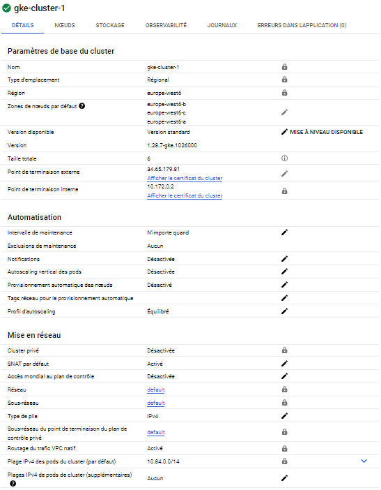
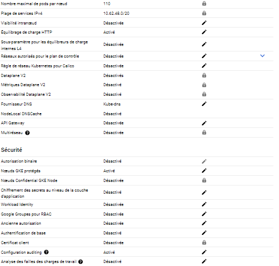
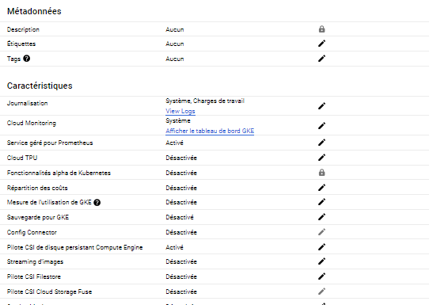

# Task 2 - Deploy the application in Kubernetes Engine

In this task you will deploy the application in the public cloud service Google Kubernetes Engine (GKE).

## Subtask 2.1 - Create Project

Log in to the Google Cloud console at <http://console.cloud.google.com/>, navigate to the __Resource Manager__ (<https://console.cloud.google.com/cloud-resource-manager>) and create a new project. 

## Subtask 2.2 - Create a cluster

Go to the Google Kubernetes Engine (GKE) console (<https://console.cloud.google.com/kubernetes/>). If necessary, enable the Kubernetes Engine API. Then create a cluster. 

* Choose a __GKE Standard__ cluster. (Please ensure that you are not using the Autopilot. The button to switch to Standard could be a bit tricky to find...)
* Give it a __name__ of the form _gke-cluster-1_
* Select a __region__ close to you.
* Set the __number of nodes__ to 2. 
* Set the __instance type__ to micro instances.
* Set the __boot disk size__ to 10 GB.
* Keep the other settings at their default values.

## Subtask 2.3 - Deploy the application on the cluster

Once the cluster is created, the GKE console will show a __Connect__ button next to the cluster in the cluster list. Click on it. A dialog will appear with a command-line command. Copy/paste the command and execute it on your local machine. This will download the configuration info of the cluster to your local machine (this is known as a _context_). It also changes the current context of your `kubectl` tool to the new cluster.

To see the available contexts, type :

```sh
$ kubectl config get-contexts
```

You should see two contexts, one for the Minikube cluster and one for the GKE cluster. The current context has a star `*` in front of it. The `kubectl` commands that you type from now on will go to the cluster of the current context.

With that you can use `kubectl` to manage your GKE cluster just as you did in task 1. Repeat the application deployment steps of task 1 on your GKE cluster.

Should you want to switch contexts, use :

```sh
$ kubectl config use-context <context>
```

## Subtask 2.4 - Deploy the ToDo-Frontend Service

On the Minikube cluster we did not have the possibility to expose a service on an external port, that is why we did not create a Service for the Frontend. Now, with the GKE cluster, we are able to do that.

Using the `redis-svc.yaml` file as an example, create the `frontend-svc.yaml` configuration file for the Frontend Service.

Unlike the Redis and API Services the Frontend needs to be accessible from outside the Kubernetes cluster as a regular web server on port 80.

  * We need to change a configuration parameter. Our cluster runs on the GKE cloud and we want to use a GKE load balancer to expose our service.
  * Read the section "Publishing Services - Service types" of the K8s documentation 
    <https://kubernetes.io/docs/concepts/services-networking/service/#publishing-services-service-types>
  * Deploy the Service using `kubectl`.

This will trigger the creation of a load balancer on GKE. This might take some minutes. You can monitor the creation of the load balancer using `kubectl describe`.

### Verify the ToDo application

Now you can verify if the ToDo application is working correctly.

  * Find out the public URL of the Frontend Service load balancer using `kubectl describe`.
  * Access the public URL of the Service with a browser. You should be able to access the complete application and create a new ToDo.


## Deliverables

Document any difficulties you faced and how you overcame them. Copy the object descriptions into the lab report (if they are unchanged from the previous task just say so).

> // On a eu le problème qu'on a évoqué à l'étape 1, rien de plus.

```````
// TODO object descriptions
C:\Windows\System32>kubectl describe all
Name:             frontend
Namespace:        default
Priority:         0
Service Account:  default
Node:             gke-gke-cluster-1-default-pool-ae91d634-38m1/10.172.0.8
Start Time:       Thu, 16 May 2024 16:57:11 +0200
Labels:           app=todo
                  component=frontend
Annotations:      <none>
Status:           Running
IP:               10.84.5.4
IPs:
  IP:  10.84.5.4
Containers:
  frontend:
    Container ID:   containerd://70befbab902cccddf63c9d21100845407f6c325cd41a293b14b243ffd4dc4a57
    Image:          icclabcna/ccp2-k8s-todo-frontend
    Image ID:       docker.io/icclabcna/ccp2-k8s-todo-frontend@sha256:5892b8f75a4dd3aa9d9cf527f8796a7638dba574ea8e6beef49360a3c67bbb44
    Port:           8080/TCP
    Host Port:      0/TCP
    State:          Running
      Started:      Thu, 16 May 2024 16:57:37 +0200
    Ready:          True
    Restart Count:  0
    Environment:
      API_ENDPOINT_URL:  http://api-svc:8081
    Mounts:
      /var/run/secrets/kubernetes.io/serviceaccount from kube-api-access-llsqp (ro)
Conditions:
  Type              Status
  Initialized       True
  Ready             True
  ContainersReady   True
  PodScheduled      True
Volumes:
  kube-api-access-llsqp:
    Type:                    Projected (a volume that contains injected data from multiple sources)
    TokenExpirationSeconds:  3607
    ConfigMapName:           kube-root-ca.crt
    ConfigMapOptional:       <nil>
    DownwardAPI:             true
QoS Class:                   BestEffort
Node-Selectors:              <none>
Tolerations:                 node.kubernetes.io/not-ready:NoExecute op=Exists for 300s
                             node.kubernetes.io/unreachable:NoExecute op=Exists for 300s
Events:
  Type    Reason     Age   From               Message
  ----    ------     ----  ----               -------
  Normal  Scheduled  11m   default-scheduler  Successfully assigned default/frontend to gke-gke-cluster-1-default-pool-ae91d634-38m1
  Normal  Pulling    11m   kubelet            Pulling image "icclabcna/ccp2-k8s-todo-frontend"
  Normal  Pulled     10m   kubelet            Successfully pulled image "icclabcna/ccp2-k8s-todo-frontend" in 25.801s (25.801s including waiting)
  Normal  Created    10m   kubelet            Created container frontend
  Normal  Started    10m   kubelet            Started container frontend


Name:             redis-deploy-56fb88dd96-zk8x7
Namespace:        default
Priority:         0
Service Account:  default
Node:             gke-gke-cluster-1-default-pool-18001efe-463k/10.172.0.6
Start Time:       Thu, 16 May 2024 17:08:03 +0200
Labels:           app=todo
                  component=redis
                  pod-template-hash=56fb88dd96
Annotations:      <none>
Status:           Running
IP:               10.84.3.5
IPs:
  IP:           10.84.3.5
Controlled By:  ReplicaSet/redis-deploy-56fb88dd96
Containers:
  redis:
    Container ID:  containerd://d0143099d8298b63f897c7c189aa835a105ca8d315301e210b6e9c90c2a2905d
    Image:         redis
    Image ID:      docker.io/library/redis@sha256:5a93f6b2e391b78e8bd3f9e7e1e1e06aeb5295043b4703fb88392835cec924a0
    Port:          6379/TCP
    Host Port:     0/TCP
    Args:
      redis-server
      --requirepass ccp2
      --appendonly yes
    State:          Running
      Started:      Thu, 16 May 2024 17:08:08 +0200
    Ready:          True
    Restart Count:  0
    Environment:    <none>
    Mounts:
      /var/run/secrets/kubernetes.io/serviceaccount from kube-api-access-6pstt (ro)
Conditions:
  Type              Status
  Initialized       True
  Ready             True
  ContainersReady   True
  PodScheduled      True
Volumes:
  kube-api-access-6pstt:
    Type:                    Projected (a volume that contains injected data from multiple sources)
    TokenExpirationSeconds:  3607
    ConfigMapName:           kube-root-ca.crt
    ConfigMapOptional:       <nil>
    DownwardAPI:             true
QoS Class:                   BestEffort
Node-Selectors:              <none>
Tolerations:                 node.kubernetes.io/not-ready:NoExecute op=Exists for 300s
                             node.kubernetes.io/unreachable:NoExecute op=Exists for 300s
Events:
  Type    Reason     Age   From               Message
  ----    ------     ----  ----               -------
  Normal  Scheduled  15s   default-scheduler  Successfully assigned default/redis-deploy-56fb88dd96-zk8x7 to gke-gke-cluster-1-default-pool-18001efe-463k
  Normal  Pulling    15s   kubelet            Pulling image "redis"
  Normal  Pulled     10s   kubelet            Successfully pulled image "redis" in 4.202s (4.202s including waiting)
  Normal  Created    10s   kubelet            Created container redis
  Normal  Started    10s   kubelet            Started container redis


Name:                     frontend-svc
Namespace:                default
Labels:                   component=frontend
Annotations:              cloud.google.com/neg: {"ingress":true}
Selector:                 app=todo,component=frontend
Type:                     LoadBalancer
IP Family Policy:         SingleStack
IP Families:              IPv4
IP:                       10.62.49.214
IPs:                      10.62.49.214
LoadBalancer Ingress:     34.65.187.210
Port:                     http  8080/TCP
TargetPort:               8080/TCP
NodePort:                 http  31459/TCP
Endpoints:                10.84.5.4:8080
Session Affinity:         None
External Traffic Policy:  Cluster
Events:
  Type    Reason                Age    From                Message
  ----    ------                ----   ----                -------
  Normal  EnsuringLoadBalancer  7m11s  service-controller  Ensuring load balancer
  Normal  EnsuredLoadBalancer   6m30s  service-controller  Ensured load balancer


Name:              kubernetes
Namespace:         default
Labels:            component=apiserver
                   provider=kubernetes
Annotations:       <none>
Selector:          <none>
Type:              ClusterIP
IP Family Policy:  SingleStack
IP Families:       IPv4
IP:                10.62.48.1
IPs:               10.62.48.1
Port:              https  443/TCP
TargetPort:        443/TCP
Endpoints:         10.172.0.2:443
Session Affinity:  None
Events:            <none>


Name:                   redis-deploy
Namespace:              default
CreationTimestamp:      Thu, 16 May 2024 17:08:03 +0200
Labels:                 <none>
Annotations:            deployment.kubernetes.io/revision: 1
Selector:               component=redis
Replicas:               1 desired | 1 updated | 1 total | 1 available | 0 unavailable
StrategyType:           RollingUpdate
MinReadySeconds:        0
RollingUpdateStrategy:  25% max unavailable, 25% max surge
Pod Template:
  Labels:  app=todo
           component=redis
  Containers:
   redis:
    Image:      redis
    Port:       6379/TCP
    Host Port:  0/TCP
    Args:
      redis-server
      --requirepass ccp2
      --appendonly yes
    Environment:  <none>
    Mounts:       <none>
  Volumes:        <none>
Conditions:
  Type           Status  Reason
  ----           ------  ------
  Available      True    MinimumReplicasAvailable
  Progressing    True    NewReplicaSetAvailable
OldReplicaSets:  <none>
NewReplicaSet:   redis-deploy-56fb88dd96 (1/1 replicas created)
Events:
  Type    Reason             Age   From                   Message
  ----    ------             ----  ----                   -------
  Normal  ScalingReplicaSet  16s   deployment-controller  Scaled up replica set redis-deploy-56fb88dd96 to 1


Name:           redis-deploy-56fb88dd96
Namespace:      default
Selector:       component=redis,pod-template-hash=56fb88dd96
Labels:         app=todo
                component=redis
                pod-template-hash=56fb88dd96
Annotations:    deployment.kubernetes.io/desired-replicas: 1
                deployment.kubernetes.io/max-replicas: 2
                deployment.kubernetes.io/revision: 1
Controlled By:  Deployment/redis-deploy
Replicas:       1 current / 1 desired
Pods Status:    1 Running / 0 Waiting / 0 Succeeded / 0 Failed
Pod Template:
  Labels:  app=todo
           component=redis
           pod-template-hash=56fb88dd96
  Containers:
   redis:
    Image:      redis
    Port:       6379/TCP
    Host Port:  0/TCP
    Args:
      redis-server
      --requirepass ccp2
      --appendonly yes
    Environment:  <none>
    Mounts:       <none>
  Volumes:        <none>
Events:
  Type    Reason            Age   From                   Message
  ----    ------            ----  ----                   -------
  Normal  SuccessfulCreate  16s   replicaset-controller  Created pod: redis-deploy-56fb88dd96-zk8x7
```````

```yaml
# frontend-svc.yaml
apiVersion: v1
kind: Service
metadata:
  labels:
    component: frontend
  name: frontend-svc
spec:
  ports:
  - port: 8080
    targetPort: 8080
    name: http
  selector:
    app: todo
    component: frontend
  type: LoadBalancer
```

Take a screenshot of the cluster details from the GKE console. Copy the output of the `kubectl describe` command to describe your load balancer once completely initialized.

> 




```````
// TODO object descriptions
C:\Windows\System32>kubectl describe service frontend-svc
Name:                     frontend-svc
Namespace:                default
Labels:                   component=frontend
Annotations:              cloud.google.com/neg: {"ingress":true}
Selector:                 app=todo,component=frontend
Type:                     LoadBalancer
IP Family Policy:         SingleStack
IP Families:              IPv4
IP:                       10.62.49.214
IPs:                      10.62.49.214
LoadBalancer Ingress:     34.65.187.210
Port:                     http  8080/TCP
TargetPort:               8080/TCP
NodePort:                 http  31459/TCP
Endpoints:                10.84.5.4:8080
Session Affinity:         None
External Traffic Policy:  Cluster
Events:
  Type    Reason                Age    From                Message
  ----    ------                ----   ----                -------
  Normal  EnsuringLoadBalancer  8m11s  service-controller  Ensuring load balancer
  Normal  EnsuredLoadBalancer   7m30s  service-controller  Ensured load balancer
```````